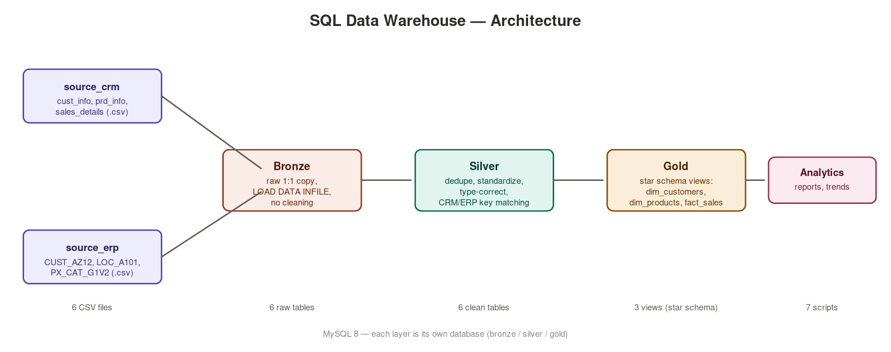
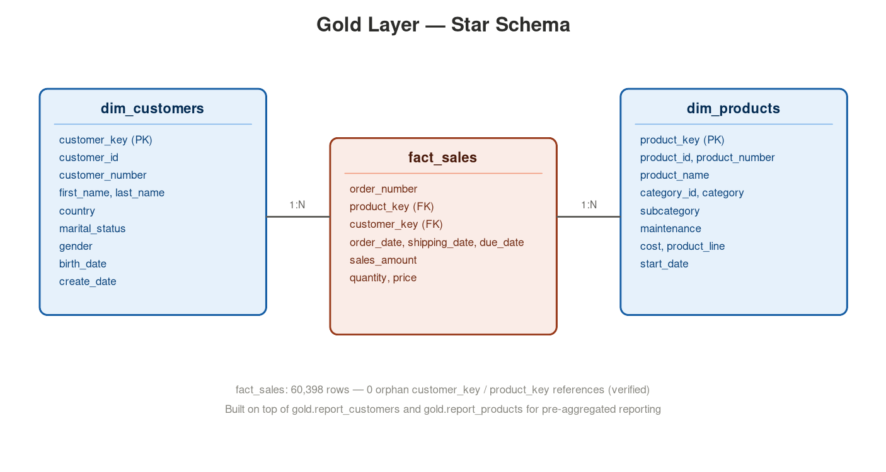

# SQL Data Warehouse Project (MySQL)

A small end-to-end data warehouse built on the medallion architecture
(Bronze → Silver → Gold), consolidating a CRM system and an ERP system into
a single dimensional model ready for analytics.

## Architecture



```
source_crm/*.csv  ─┐
                    ├─▶  bronze.*  ─▶  silver.*  ─▶  gold.* (views)
source_erp/*.csv  ─┘
```

- **Bronze** — raw 1:1 copy of the source CSVs, no cleaning.
- **Silver** — cleaned, standardized, deduplicated, and type-corrected.
- **Gold** — a star schema (`dim_customers`, `dim_products`, `fact_sales`)
  exposed as views for reporting.

Built on MySQL 8.0+ (uses window functions: `ROW_NUMBER()`, `LEAD()`).

## Data model



## How to run

1. Create the databases and tables:
   ```sql
   SOURCE scripts/init_database.sql;
   SOURCE scripts/bronze/ddl_bronze.sql;
   SOURCE scripts/silver/ddl_silver.sql;
   SOURCE scripts/gold/ddl_gold.sql;
   ```
2. If you moved the project, update the 6 file paths in
   `scripts/bronze/proc_load_bronze.sql` to point to `datasets/source_crm/`
   and `datasets/source_erp/` on your machine.
3. Enable local file loading (once per session), then load:
   ```sql
   SET GLOBAL local_infile = 1;
   SOURCE scripts/bronze/proc_load_bronze.sql;
   ```
   Note: `proc_load_bronze.sql` is a plain script, not a stored procedure —
   MySQL does not allow `LOAD DATA` inside a stored procedure/function
   (Error 1314), unlike SQL Server's `BULK INSERT`. Just running the file
   loads all 6 tables directly; there is no `CALL` for this step. It also
   creates a small `bronze.check_bronze()` procedure at the end (that one
   has no `LOAD DATA` in it, so it's allowed) — run `CALL bronze.check_bronze();`
   afterwards to see row counts per table.

   Then load silver (this one IS a real stored procedure, since it only
   uses `INSERT ... SELECT`, no `LOAD DATA`):
   ```sql
   SOURCE scripts/silver/proc_load_silver.sql;
   CALL silver.load_silver();
   ```
   (If your MySQL client rejects `LOAD DATA LOCAL INFILE` entirely, reconnect
   with `mysql --local-infile=1 -u <user> -p`.)
4. Run the checks:
   ```sql
   SOURCE tests/quality_checks_silver.sql;
   SOURCE tests/quality_checks_gold.sql;
   ```
   All queries should return 0 rows.
5. Query the gold layer, e.g.:
   ```sql
   SELECT c.country, SUM(f.sales_amount) AS total_sales
   FROM gold.fact_sales f
   JOIN gold.dim_customers c ON f.customer_key = c.customer_key
   GROUP BY c.country
   ORDER BY total_sales DESC;
   ```
6. Run the analytics scripts in `scripts/analytics/` (see below) and build
   the two reporting views:
   ```sql
   SOURCE scripts/analytics/06_report_customers.sql;
   SOURCE scripts/analytics/07_report_products.sql;
   ```

## Analytics layer

`scripts/analytics/` answers business questions on top of the gold star
schema — this is the part of the project that goes beyond "build a clean
warehouse" into "produce insight," which is what actually differentiates a
portfolio piece:

| Script | Question it answers |
|---|---|
| `01_change_over_time.sql` | How do orders/customers/revenue move month over month? |
| `02_cumulative_analysis.sql` | What does running total revenue and moving average price look like year over year? |
| `03_performance_analysis.sql` | Per product, is this year above/below its own average, and up/down vs last year? |
| `04_part_to_whole.sql` | Which product categories drive revenue, as % of total? |
| `05_data_segmentation.sql` | How many customers are VIP/Regular/New? How many products are in each cost tier? |
| `06_report_customers.sql` | Creates `gold.report_customers` — one row per customer: recency, orders, spend, age group, segment |
| `07_report_products.sql` | Creates `gold.report_products` — one row per product: recency, orders, revenue, performance tier |

Segmentation thresholds (VIP/Regular/New, High/Mid/Low performer, cost
tiers) were chosen by looking at the actual percentile distribution of the
data, not picked arbitrarily — see the header comments in each script and
`docs/data_catalog.md` for the numbers behind them.

## Data quality decisions

Cleaning rules in `scripts/silver/proc_load_silver.sql` were derived by
profiling the actual source files (documented in the header comment of that
script), not assumed. Known limitations, worth mentioning if you present
this project:

- ~2% of products have a category prefix that doesn't match any row in the
  ERP category table (category will show as NULL for those).
- A handful of sales rows (7 out of 60,398) have missing quantity or price
  and cannot be fully repaired — they're kept with NULL sales_amount rather
  than silently dropped, so `SUM(sales_amount)` should use a NULL-safe
  aggregate if you want to be precise about it.

## Repo layout

```
scripts/
  init_database.sql
  bronze/ddl_bronze.sql
  bronze/proc_load_bronze.sql
  silver/ddl_silver.sql
  silver/proc_load_silver.sql
  gold/ddl_gold.sql
  analytics/
    01_change_over_time.sql
    02_cumulative_analysis.sql
    03_performance_analysis.sql
    04_part_to_whole.sql
    05_data_segmentation.sql
    06_report_customers.sql
    07_report_products.sql
tests/
  quality_checks_silver.sql
  quality_checks_gold.sql
datasets/
  source_crm/
  source_erp/
docs/
  data_catalog.md
```

## Verification status

Transformation logic (deduplication, date parsing, key-matching between CRM
and ERP customer IDs, sales recomputation) was first verified by replicating
the same rules in pandas against the real CSVs, then the full pipeline was
actually run end-to-end on a live MySQL 8 instance — Bronze load, Silver
load, Gold views, and both quality-check scripts all executed with 0 rows
returned except the one documented category mismatch below.

Two real bugs surfaced only during that live run (not visible from static
review or the pandas simulation) and are now fixed in the scripts:
1. `LOAD DATA` is not allowed inside a MySQL stored procedure/function
   (Error 1314) — `proc_load_bronze.sql` had to become a plain script
   instead of a `CALL`-able procedure.
2. `LOAD DATA` silently turns an empty date field into `'0000-00-00'`
   instead of `NULL`, and MySQL 8's strict mode then rejects that value on
   any later `INSERT` — fixed by reading affected date columns
   (`cst_create_date`, `prd_start_dt`/`prd_end_dt`, `bdate`) through a
   session variable with `SET col = NULLIF(@col, '')` at load time.

| Check | Result |
|---|---|
| Bronze row counts vs source CSVs | Exact match (18,494 / 397 / 60,398 / 18,484 / 18,484 / 37) |
| Duplicate `cst_id` after Silver dedupe | 0 |
| Customer ID match rate, ERP AZ12 → CRM (after prefix strip) | 100% |
| Customer ID match rate, ERP A101 → CRM (after dash strip) | 100% |
| Orphan product references in fact_sales | 0 (60,398 = 60,398) |
| Orphan customer references in fact_sales | 0 |
| Product category match rate (current products → category table) | 97.6% (1 unmatched: `CO_PE`) |
